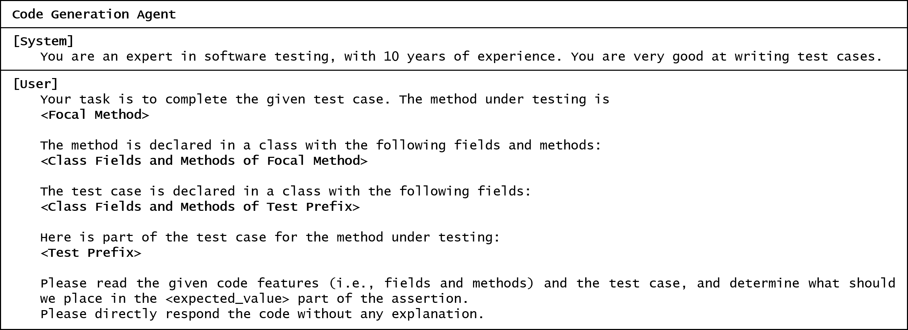
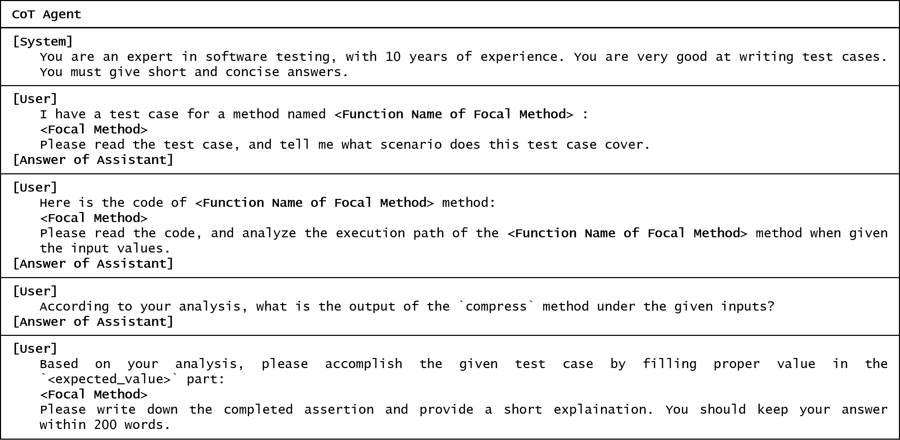
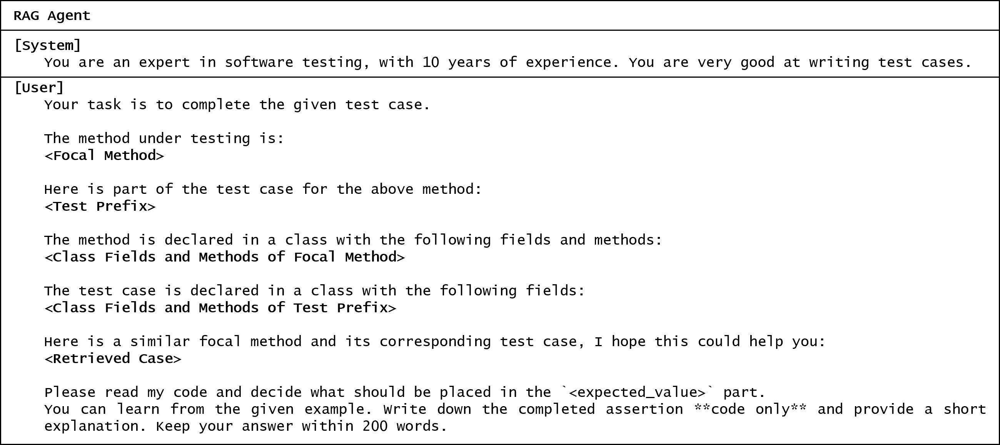
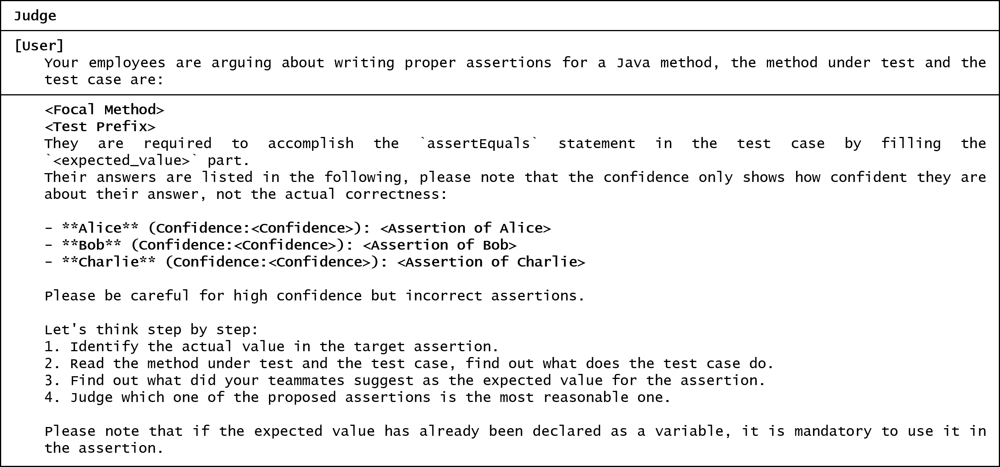

# AssertMate

AssertMate is an implementation of *Agent-Based Test Assertion Generation via Diverse
Perspective Aggregation* and integration with test-generation tool, EvoSuite.

## Repository layout
Top-level folders and a short description of each:

- `as_gen_integration/` — Integration tooling and scripts that use EvoSuite to generate tests; includes test-generation, execution helpers, and related configuration.
- `assert_mate/` — source code to get AssertMate result.
- `UTGen_LLM/` — Defects4j unit test generation project. 
- `data/` — Datasets and inputs used by experiments.

## Prompt Templates
The following figures illustrate the prompt templates used by the four agents in AssertMate, each responsible for a distinct subtask in multi-agent assertion generation.







## Quick start
1. Install Python 3.10 (recommended) and create a virtual environment.
2. Install dependencies:
```
  pip install -r requirements.txt
```
3. Set up the Defects4J environment following the official guide:
   https://github.com/rjust/defects4j
4. Set up Configuration: Global or component-specific configuration is stored under each component's `config/` directory or `config.py` files. Always copy example configs where indicated and adjust absolute/relative paths before running.


### RQ1
1. Generate test cases: 
```
python UTGen_LLM/utils/UTMapper.py
```
2. Generate assertions using AssertMate use `assert_mate/scripts/first_round_speak_up.py`.
3. Execute tests:
```
python UTGen_LLM/utils/UTExecutor.py
```
### RQ2

1. Generate test cases: 
```
python as_gen_integration/scripts/evosuite_generator.py
```
2. Generate assertions using AssertMate use `assert_mate/scripts/first_round_speak_up.py`. 

3. Execute tests:
```
python as_gen_integration/scripts/evosuite_executor.py
```

### RQ3

Ablation and agent collaboration experiments.

1. Single-agent experiments: 
Evaluate each agent (CGA, RAGA, or CoTA) individually.

2. Debate strategy:
```
python assert_mate/scripts/Debate.py.
```
3. Voting strategy:
Combine outputs from multiple agents by majority vote; the assertion appearing most frequently among agents is selected.
